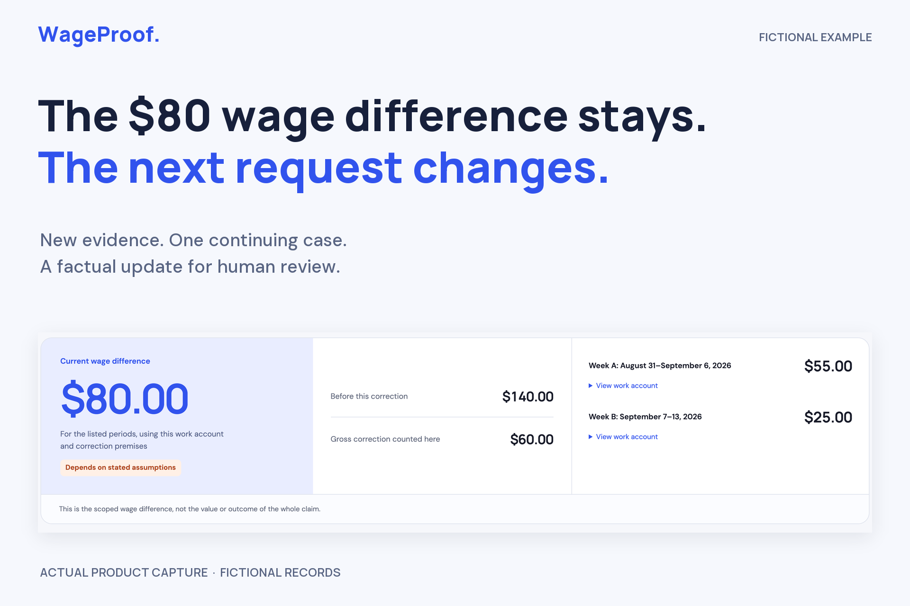
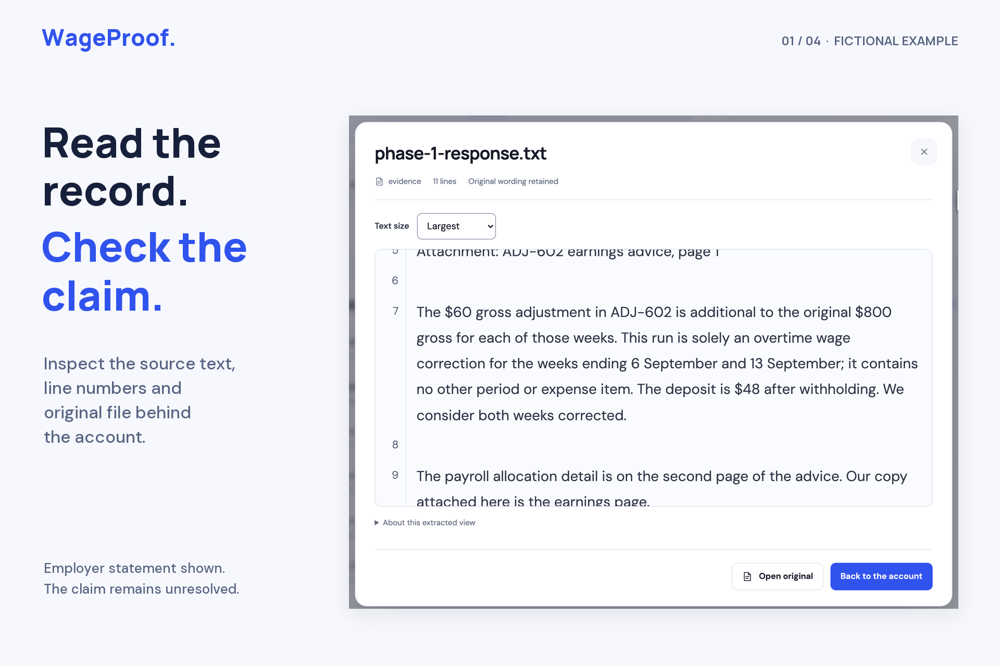
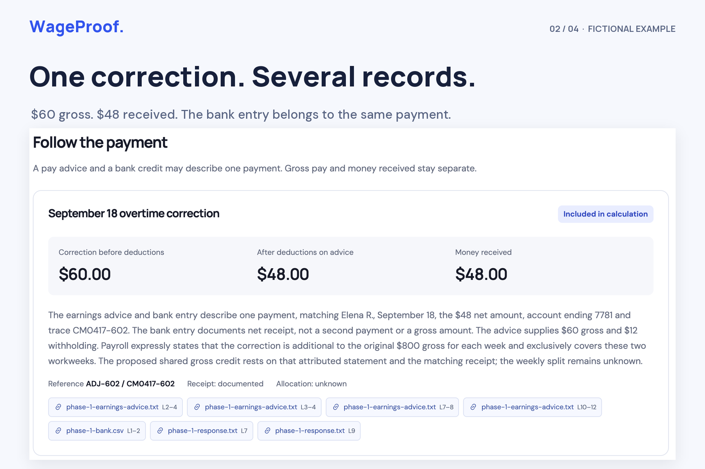
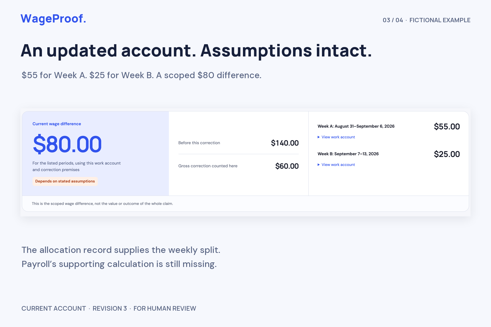
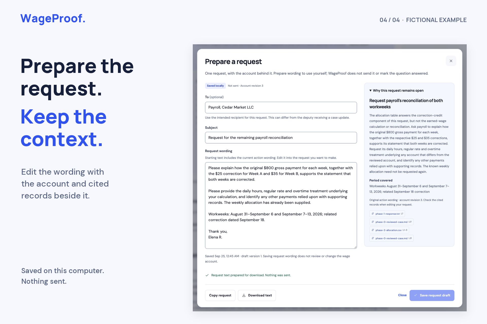

# WageProof

> **History note:** Commit author dates across September 21–25 are assigned dates for a reconstructed release import, not a contemporaneous development log. [Read the history disclosure and preserved original publication](docs/COMMIT-HISTORY.md).

[Watch the 2:54 demo](https://youtu.be/l9BUFbmUFzg) · [Project story](docs/DEVPOST-STORY.md) · [Judge walkthrough](docs/JUDGE-WALKTHROUGH.md) · [Evaluation and limitations](evaluation/upgrade/public/FINAL-EVALUATION.md)

[](https://youtu.be/l9BUFbmUFzg)

A local workspace for understanding a pay correction and preparing a source-linked case update. Import records, see what changed since the last reviewed account, check important payment interpretations and prepare a portable factual update. Later evidence creates another reviewable version while the original records remain intact.

The first workflow concerns a California hourly worker with an existing wage dispute. A pending claim can be routed to the assigned deputy using the worker's actual correspondence. Missing claim details or calculation premises stay unknown; a factual payment update can still be prepared.

## Inspect the prepared example without model access

Node.js 22.12+ with npm and Python 3.11+ are enough to inspect the bundled recorded example. Clone this repository and enter its directory:

```sh
git clone https://github.com/sudo-anshul/wageproof.git
cd wageproof
npm ci
npm run doctor -- --inspection
npm run build
npm start
```

Open **http://127.0.0.1:4318** and choose **Inspect the prepared example**. Browse three genuine recorded revisions, inspect six fictional source records and export a labelled evidence packet. This fixed example is read-only: no model request, case write or new review is made. Review markers document a previous technical walkthrough, not worker or practitioner approval. Its recorded source release is `upgrade-candidate-4`; the current application release is `lexhack-requests-2`.

The example preserves the $140 → $80 → $80 progression. Later allocation evidence changes the remaining weekly account to $55/$25 while payroll reconciliation is still unresolved. It is a known fictional demonstration, not a fresh model evaluation.

## Start fresh analysis locally

This build was developed on macOS with Node 22.20, Python 3.11+ and a configured Codex CLI. Python's POSIX file locking protects the data folder from concurrent servers. Linux is intended but has not been verified; Windows is not supported by this lock implementation.

Requirements for fresh analysis:

- Node.js 22.12 or later and npm.
- Python 3.11 or later.
- An installed, authenticated `codex` CLI with an existing model configuration.
- Poppler's `pdfinfo`, `pdftotext` and `pdfimages` for PDFs; `pdftoppm` and Tesseract with English data for image-bearing PDF pages and PNG/JPEG OCR. Plain-text input works without those extraction tools.

Run from this directory:

```sh
npm ci
npm run doctor
npm run build
npm start
```

Open **http://127.0.0.1:4318**. For development, use `npm run dev` and **http://127.0.0.1:5173**. Only one server may open a data folder at a time. A duplicate launch fails without disturbing the first server.

The app uses the existing Codex configuration; it does not include credentials or a fake model fallback. Analysis sends extracted source text, intake context and the previous proposed account to that configured model service. Original files and application case storage remain local. **Inference is not offline.** This project's demonstrations and evaluations use fictional records.

## Use the complete workflow

1. Start a case with the claim stage and recipient details actually available, or open a clearly labelled fictional example.
2. Add TXT, Markdown, CSV, text PDF, PNG or JPEG records. Tag a supplied filing copy as a filed original. An attributed note can record the worker's own account or a conversation.
3. Run analysis. It creates a proposed account from the imported text, checks exact source quotes and calculates the supported wage schedule.
4. Inspect the named comparison with the last reviewed version. Open a source beside the interpretation being checked. Focused payment decisions cover identity, receipt, additionality, coverage and allocation; **keep uncertain** changes the underlying calculation. A reasoned correction becomes a new attributed source and draft. Related unchanged explanations are reopened rather than silently carried forward.
5. Use the account after reviewing its assumptions and unresolved questions. This records review for that exact revision, not a legal determination.
6. Open **Prepare update**, check the short factual document and choose the included sources. Download a ZIP containing the readable update, detailed supplement, selected unchanged originals, exact extracted text, source index and integrity manifest. Unzip it before opening `update.html`; its evidence links work without the app running. Individual Markdown and printable HTML remain available. Nothing is sent or filed.
7. Add later evidence and analyze again. The previous review becomes stale; history retains earlier versions. Confirm the changed explanation and current requests before exporting the new revision.

The first fictional example has three input phases. Starting it again creates a fresh case and does not overwrite prior runs. To rehearse with separate storage, stop the current server and run `WAGEPROOF_DATA_DIR="$PWD/.data-rehearsal" npm start`. Keep existing case folders when resetting a demonstration.

## Supported scope and limits

English TXT/MD/CSV, text-layer PDF and PNG/JPEG OCR; up to 12 files per import, 12 MiB per file, 40 MiB per request, 40 PDF pages and 200,000 extracted characters per case. Image-only PDFs require page images or a transcription. Mixed PDFs retain their text layer and add a separately labelled OCR view of each image-bearing page; these are views of the same original page, not extra records or payments. Mixed-PDF OCR is limited to 12 image-bearing pages and a 120-second extraction budget. If any required page cannot be read, the import fails explicitly instead of retaining partial text. OCR text is inspectable; source matching verifies text anchors, not document authenticity or extraction accuracy.

The calculation is a declared ordinary California hourly slice with supplied workweek, workday, rate and applicability premises. It supports daily and weekly overtime without duplicate premium minutes, double time and linked allocation uncertainty. It does not establish legal applicability, penalties, interest, timeliness, seventh-day regimes, variable rates, bonuses, special-industry rules or whole-claim disposition. Unsupported premises leave the calculation unassessed while preserving factual payment information. See [the domain contract](docs/DOMAIN-CONTRACT.md).

Money uses integer cents. A bank deposit is a net receipt, not another gross payment. Replacement advice is not automatically new money. An excess assigned to one period is not silently used to settle another. An unchanged total can still require a new explanation and review.

## Recovery and data

Cases, immutable original bytes, jobs and version history live in `.data/` by default. Writes replace the case JSON atomically. Stale browser writes are rejected. Restart recovery checks for a durably saved revision before marking interrupted work failed; cancellation after a saved result reports that result. Failed/cancelled analyses preserve prior revisions. A late result cannot replace a case changed while it was running. Unreadable saved cases remain visible as needing recovery. This is not a claim of filesystem power-loss durability.

Storage uses private filesystem permissions but is not application-encrypted. There is no user account system or internet deployment in this build. The service binds to `127.0.0.1`. Keep backups private; do not put `.data`, credentials or private records into source control.

Exports contain quoted source excerpts, filenames, line numbers and hashes. The ZIP freezes the selected revision and source selection, explicitly lists omitted sources, and excludes later sources from older revisions. Individual legacy Markdown/HTML downloads can contain local-server links; use the ZIP when evidence needs to travel with the update. A packet is a recipient artifact, not a complete case backup.

For setup diagnostics, run `npm run doctor -- --inspection` for recorded inspection or `npm run doctor` for fresh analysis or open **About this local workspace**. These identify the configured model service, server-startup source/build identity and active data directory. They check local prerequisites and credential presence without sending a model request. Every analysis attempt records timing, outcome and provider-reported token usage when exposed; monetary inference cost is not inferred. `PORT`, `WAGEPROOF_DATA_DIR`, `WAGEPROOF_DIST_DIR` and `WAGEPROOF_RELEASE` select an isolated local runtime.

## Current local upgrade — lexhack-requests-2

A current open records request can become an editable, unsent local draft. Inspect its source basis, confirm the recipient, edit and save before copying or downloading. Later evidence or revisions make old drafts read-only. Saving wording does not send a message, answer a question or review the wage account. The prepared example offers an immutable fictional request preview without inference.

This release also keeps cleared claim and recipient details unknown across the interface and exports and labels unavailable cases as needing recovery. See [the request guide](docs/REQUEST-DRAFTS.md), [implementation](docs/UPGRADE-REQUESTS-IMPLEMENTATION.md) and [current project story](docs/DEVPOST-STORY.md). The [release report](docs/UPGRADE-REQUESTS-RELEASE.md) and [fresh-archive setup report](docs/UPGRADE-REQUESTS-SETUP.md) describe the checked release bytes. [Publication notes](docs/PUBLICATION.md) distinguish this public source import from the original release archive. Older reports below retain their named release scope and do not describe new model runs.


## Verification and provenance

```sh
npm test
```

Domain tests check accounting and provenance rules; isolated server tests use a clearly labelled fake process only to exercise cancellation, replay, restart and state races. They are separate from actual model evaluations, which use the configured service without canned answers.

Historical reports preserve earlier failures and the strong ordinary comparator’s matching results. The earlier upgrade's [engineering review](docs/UPGRADE-ENGINEERING-REVIEW.md), [independent integration review](docs/UPGRADE-INDEPENDENT-INTEGRATION-REVIEW.md), [rendered UX review](docs/UPGRADE-UX-REVIEW.md) and [fresh evaluation protocol](evaluation/upgrade/public/PROTOCOL.md) distinguish implementation checks from model evaluation. The completed evaluation and final setup are linked below; the earlier protocol retains its prospective scope.

The previous upgrade’s [fresh synthetic evaluation](evaluation/upgrade/public/FINAL-EVALUATION.md) and [source setup record](docs/UPGRADE-CLEAN-SETUP-PREVIOUS.md) remain included. Its final release report is preserved in the separately supplied previous handoff. That previous source passed 80 tests and 24 isolated runtime checks; those counts do not describe this request-draft release. Fresh reserve targets passed in both workflows; the primary failures and subsequent deterministic repairs remain separately reported.

The included [evaluation protocol](evaluation/upgrade/public/PROTOCOL.md) identifies its observation scope. Results and limitations belong to the recorded release and inputs. Known development examples are not held-out evidence; agent reviews are not worker studies or legal validation. No wage recovery, comparative human time saving, adoption or award probability is established by this build.

The application source is original project work. Icons come from `lucide-react`; the accepted cobalt interface uses locally served Manrope and DM Sans. Their licenses are in `public/fonts/`. The application source contains no stock footage or generated voice. The separately hosted demonstration uses disclosed ElevenLabs Neha AI narration. Third-party dependency versions are pinned by `package-lock.json`; their licenses remain in the installed packages.

Previous finishing changes and reused evidence are documented in [the finishing implementation](docs/UPGRADE-FINISH-IMPLEMENTATION.md). The separately delivered release report and exact-source setup receipts bind the completed checks to this archive. See [the current project story](docs/DEVPOST-STORY.md) and [the judge walkthrough](docs/JUDGE-WALKTHROUGH.md). Older reports retained in this source archive describe their named releases.

The [hosted demonstration](https://youtu.be/l9BUFbmUFzg) uses real application captures, fictional records, disclosed shortened processing waits and ElevenLabs Neha AI narration. The original human-recording-ready cut is preserved locally. LexHack's [organizer guidance](https://lexhack-2026.devpost.com/updates/46441-updated-discord-link-important-submission-tips) asks for the creator's own pitch and says to avoid AI voiceovers; that submission dependency remains unresolved. This repository provides source for local execution. There is no public app deployment, and no Devpost submission has been made.

## Product gallery

The images use actual product captures and fictional records; editorial text sits outside the UI. The older core captures retain their recorded release identity, while the saved-request capture shows `lexhack-requests-2`.

| Inspect the source | Follow the payment |
| --- | --- |
|  |  |
| Review the account | Prepare the request |
|  |  |
